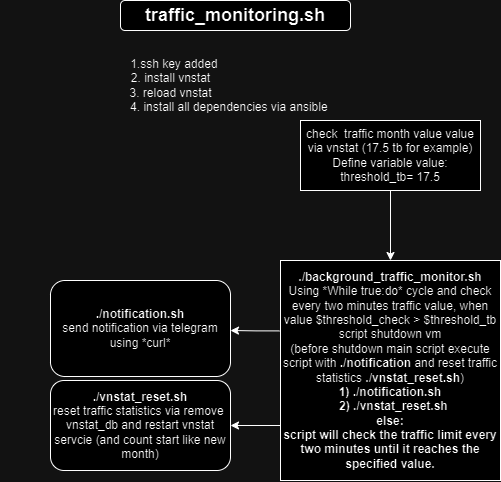

#Ubuntu-bash
Ubuntu tips for home lab:yum:
1) traffic_monitor_project folder - Set your traffic limit, and when limit reached - script shutdown your machine. (tested on ubuntu)
short description: (for more, check readme in folder)

2) vnstat_reset.sh - reset traffic stat for vnstat utils in linux
scripts_for_test folder
3) float_compare.sh float value compare
4) ip_check_traf.sh - check RX & TX stats via 'ip -s'
5) uuid_generate_replace.sh - replace and generate new strings with - uuid:
6) backup_check - check if backup created via duplicati, push status via curl
