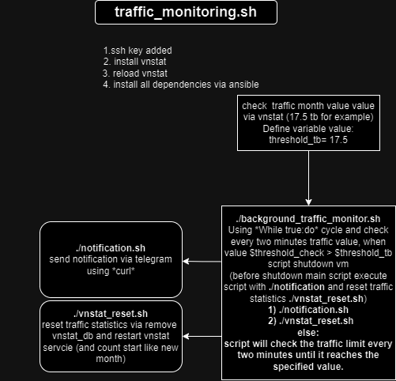

.sh scripts for traffic monitor project
- background_traffic_monitor.sh - Set your traffic limit, and when limit reached - script shutdown your machine. (tested on ubuntu (arm and x86))
- vnstat_reset.sh - reset traffic stat for vnstat utils in linux

script diagram 
        ⭳
https://viewer.diagrams.net/?tags=%7B%7D&highlight=0000ff&edit=_blank&layers=1&nav=1&title=%D0%94%D1%96%D0%B0%D0%B3%D1%80%D0%B0%D0%BC%D0%B0%20%D0%B1%D0%B5%D0%B7%20%D0%BD%D0%B0%D0%B7%D0%B2%D0%B8.drawio#Uhttps%3A%2F%2Fdrive.google.com%2Fuc%3Fid%3D1SXfmULLiNa0Bl00N9wQUvSmrR8mwmatp%26export%3Ddownload
